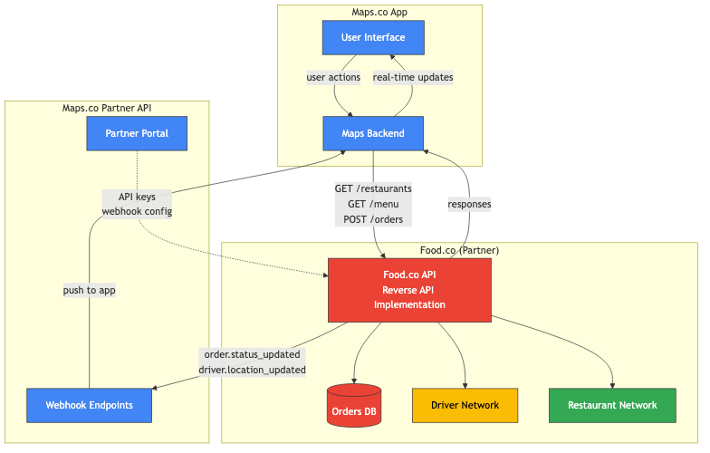
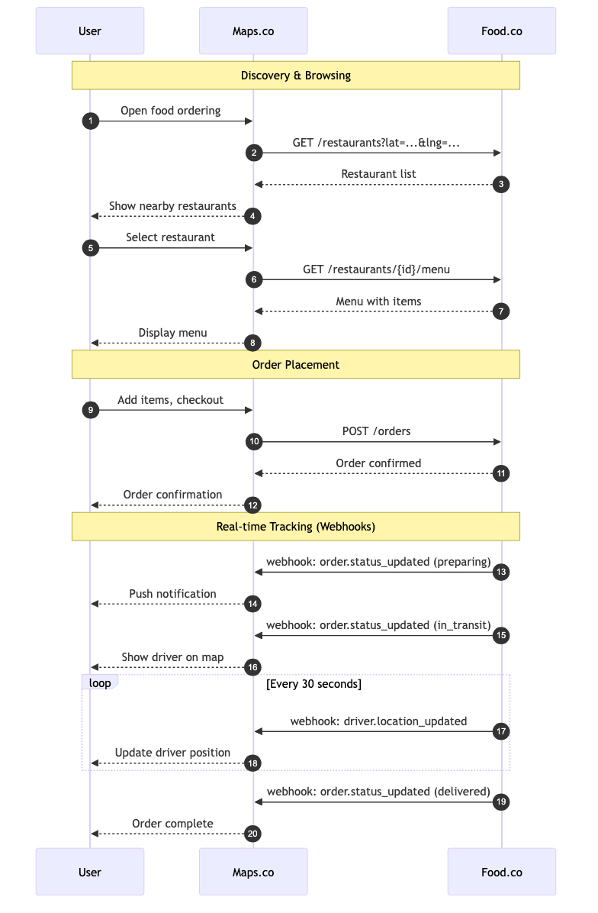

# Part 2: System Design - Reverse API

**Scenario:** You're a PM at Maps.co (like Google Maps). You've partnered with food delivery companies (Food.co = Uber Eats/DoorDash). Users can order food directly in the Maps app. Food.co partners implement your "reverse API" - you define the contract, they host the endpoints.

---

## High-Level Architecture



**Two communication patterns:**

| Direction | Pattern | Purpose |
|-----------|---------|---------|
| Maps.co → Food.co | Reverse API | Request data, trigger actions |
| Food.co → Maps.co | Webhooks | Push async updates |

---

## Reverse API Endpoints (Food.co Implements)

These endpoints are **hosted by Food.co** but **defined by Maps.co**. Maps.co calls these to fetch data and trigger actions.

### 1. List Restaurants

```
GET /v1/restaurants?lat={lat}&lng={lng}&radius={radius}
```

**Query Parameters:**
| Field | Type | Description |
|-------|------|-------------|
| lat | float | User latitude |
| lng | float | User longitude |
| radius | int | Search radius in meters |
| cuisine | string? | Optional filter |

**Response:**
```json
{
  "restaurants": [
    {
      "id": "rest_abc123",
      "name": "Burger Palace",
      "cuisine": "American",
      "rating": 4.5,
      "estimated_delivery_minutes": 25,
      "delivery_fee": 299,
      "minimum_order": 1500,
      "is_open": true,
      "location": { "lat": 37.7749, "lng": -122.4194 }
    }
  ],
  "next_cursor": "cursor_xyz"
}
```

---

### 2. Get Restaurant Menu

```
GET /v1/restaurants/{restaurant_id}/menu
```

**Response:**
```json
{
  "restaurant_id": "rest_abc123",
  "categories": [
    {
      "id": "cat_001",
      "name": "Burgers",
      "items": [
        {
          "id": "item_burger01",
          "name": "Classic Cheeseburger",
          "description": "Beef patty with cheese, lettuce, tomato",
          "price": 1299,
          "image_url": "https://...",
          "available": true,
          "customizations": [
            {
              "id": "cust_001",
              "name": "Extras",
              "type": "multi_select",
              "options": [
                { "id": "opt_bacon", "name": "Bacon", "price": 200 },
                { "id": "opt_egg", "name": "Fried Egg", "price": 150 }
              ]
            }
          ]
        }
      ]
    }
  ]
}
```

---

### 3. Create Order

```
POST /v1/orders
```

**Request:**
```json
{
  "maps_order_id": "maps_ord_789",
  "restaurant_id": "rest_abc123",
  "customer": {
    "id": "maps_user_456",
    "name": "Jamie Thompson",
    "phone": "+14155551234"
  },
  "delivery_address": {
    "street": "123 Main St",
    "city": "San Francisco",
    "state": "CA",
    "zip": "94102",
    "lat": 37.7850,
    "lng": -122.4083,
    "instructions": "Ring doorbell twice"
  },
  "items": [
    {
      "item_id": "item_burger01",
      "quantity": 2,
      "customizations": [
        { "customization_id": "cust_001", "option_ids": ["opt_bacon"] }
      ],
      "special_instructions": "No onions"
    }
  ],
  "payment": {
    "method": "maps_wallet",
    "maps_transaction_id": "maps_txn_999"
  }
}
```

**Response:**
```json
{
  "food_order_id": "food_ord_xyz",
  "maps_order_id": "maps_ord_789",
  "status": "confirmed",
  "estimated_delivery_at": "2026-01-07T10:45:00Z",
  "total": {
    "subtotal": 2998,
    "tax": 270,
    "delivery_fee": 299,
    "total": 3567
  }
}
```

---

### 4. Get Order Status

```
GET /v1/orders/{food_order_id}
```

**Response:**
```json
{
  "food_order_id": "food_ord_xyz",
  "maps_order_id": "maps_ord_789",
  "status": "in_transit",
  "status_history": [
    { "status": "confirmed", "at": "2026-01-07T10:20:00Z" },
    { "status": "preparing", "at": "2026-01-07T10:22:00Z" },
    { "status": "ready_for_pickup", "at": "2026-01-07T10:35:00Z" },
    { "status": "in_transit", "at": "2026-01-07T10:38:00Z" }
  ],
  "driver": {
    "name": "Alex",
    "phone": "+14155559999",
    "location": { "lat": 37.7800, "lng": -122.4100 }
  },
  "estimated_delivery_at": "2026-01-07T10:48:00Z"
}
```

**Order Statuses:**
- `confirmed` - Order accepted by restaurant
- `preparing` - Kitchen is making the food
- `ready_for_pickup` - Waiting for driver
- `in_transit` - Driver en route to customer
- `delivered` - Complete
- `cancelled` - Order cancelled

---

### 5. Cancel Order

```
POST /v1/orders/{food_order_id}/cancel
```

**Request:**
```json
{
  "reason": "customer_requested",
  "requested_by": "maps_user_456"
}
```

**Response:**
```json
{
  "food_order_id": "food_ord_xyz",
  "status": "cancelled",
  "refund": {
    "amount": 3567,
    "status": "pending"
  }
}
```

---

## Webhooks (Maps.co Exposes)

These endpoints are **hosted by Maps.co** for Food.co to push real-time updates.

### Webhook Registration

Food.co registers their webhook endpoint via partner portal or API:
```
POST /v1/partners/webhooks
{
  "url": "https://api.food.co/maps-webhooks",
  "events": ["order.status_updated", "driver.location_updated"],
  "secret": "whsec_..."
}
```

---

### 1. Order Status Updated

```
POST {partner_webhook_url}
```

```json
{
  "event": "order.status_updated",
  "timestamp": "2026-01-07T10:38:00Z",
  "data": {
    "food_order_id": "food_ord_xyz",
    "maps_order_id": "maps_ord_789",
    "status": "in_transit",
    "previous_status": "ready_for_pickup",
    "estimated_delivery_at": "2026-01-07T10:48:00Z"
  }
}
```

---

### 2. Driver Location Updated

```json
{
  "event": "driver.location_updated",
  "timestamp": "2026-01-07T10:40:00Z",
  "data": {
    "food_order_id": "food_ord_xyz",
    "maps_order_id": "maps_ord_789",
    "driver": {
      "location": { "lat": 37.7820, "lng": -122.4090 },
      "heading": 45,
      "speed_mph": 15
    }
  }
}
```

---

### 3. Order Issue Reported

```json
{
  "event": "order.issue_reported",
  "timestamp": "2026-01-07T10:50:00Z",
  "data": {
    "food_order_id": "food_ord_xyz",
    "maps_order_id": "maps_ord_789",
    "issue_type": "item_unavailable",
    "affected_items": ["item_burger01"],
    "suggested_resolution": "partial_refund",
    "refund_amount": 1499
  }
}
```

---

## API Flow Diagram



---

## Additional Considerations

### Authentication & Security

- **API Keys**: Food.co authenticates to Maps.co spec using partner API keys
- **Webhook Signatures**: Maps.co signs webhook payloads; Food.co verifies with shared secret
- **Rate Limiting**: Maps.co enforces rate limits per partner
- **IP Allowlisting**: Optional for high-security partners

### Error Handling

Standard error response format:
```json
{
  "error": {
    "code": "restaurant_closed",
    "message": "Restaurant is not accepting orders",
    "retry_after": 3600
  }
}
```

| HTTP Code | Meaning |
|-----------|---------|
| 400 | Bad request (validation error) |
| 401 | Invalid API key |
| 404 | Resource not found |
| 409 | Conflict (e.g., order already cancelled) |
| 429 | Rate limited |
| 503 | Partner temporarily unavailable |

### Edge Cases

| Scenario | Handling |
|----------|----------|
| Restaurant closes mid-order | Food.co sends `order.issue_reported` webhook |
| Driver no-show | Food.co reassigns or cancels with refund |
| Payment failure | Maps.co handles; order creation fails |
| Partial availability | Return `available: false` on menu items |

### Idempotency

- `maps_order_id` serves as idempotency key for order creation
- Duplicate POST to `/orders` with same `maps_order_id` returns existing order

### Versioning

- API version in URL path (`/v1/`, `/v2/`)
- Breaking changes require new version
- Deprecation notice 6 months before sunset

---

## Quick Reference

| Endpoint | Direction | Purpose |
|----------|-----------|---------|
| `GET /restaurants` | Maps → Food | Browse nearby restaurants |
| `GET /restaurants/{id}/menu` | Maps → Food | View menu |
| `POST /orders` | Maps → Food | Place order |
| `GET /orders/{id}` | Maps → Food | Check status |
| `POST /orders/{id}/cancel` | Maps → Food | Cancel order |
| `POST {webhook_url}` | Food → Maps | Push updates |
